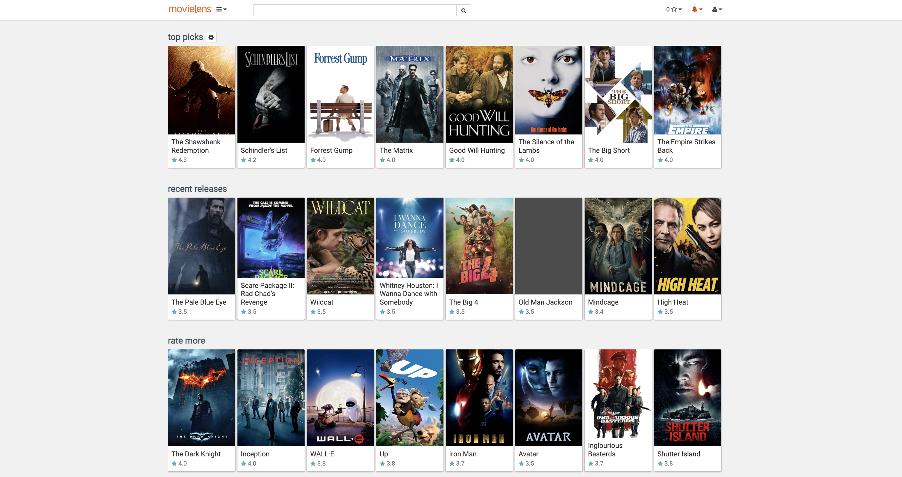

# Movie-Recommender

In our daily life when we are shopping online, or looking for a movie to watch, we normally ask our friends or search for it. So what about if there is a system that can understand you, and recommend for you based on your interests, that would be soo cool isn’t it. Well, that exactly what recommender systems are made for.

This notebook is going to explain how I worked throughout the entire life cycle of recommender system, and provide my solutions to some technical issues.

For the recommender system I will use Content-based and Model Based Collaborative filtering . Recommender systems are built on MovieLens dataset with 100,000 movie ratings. These Recommender systems were built using Pandas operations and by fitting Machine Learning models to suggest movies for the users based on similar users and for queries specific to genre, user, movie, rating.



# Table of Content
- [Business Understanding](https://github.com/yesimcebeci/movie-recommender#business-understanding)
- [Data Understanding](https://github.com/yesimcebeci/movie-recommender#data-understanding)
- [Data Analysis](https://github.com/yesimcebeci/movie-recommender#sentiment-analysis)
- [Recommendation Engine](https://github.com/yesimcebeci/movie-recommender#recommendation-engine)
- [Conclusion and Future Consideration](https://github.com/yesimcebeci/movie-recommender#limitations-and-future-consideration)
- [References](https://github.com/yesimcebeci/movie-recommender#references)
- [For More Information](https://github.com/yesimcebeci/movie-recommender#for-more-information)

# Business Understanding 

MovieLens is a website and virtual community that recommends movies for its users to watch movies based on users' movie ratings and movie reviews

In this project, I will build recommendation engines and improve upon predictions iteratively so that the end user can be provided with better movie suggestions on their homepages.

# Data Understanding 

The dataset that I’m working with is MovieLens, one of the most common datasets that is available on the internet for building a Recommender System. The version of the dataset that I’m working with (ml-latest-small) contains 100836 ratings of 9742 movies made by 610 MovieLens users who joined MovieLens in 2018.

# Data Analysis

After processing the data and doing some exploratory analysis, here are the most interesting features of this dataset:


- The top 5 genres are, in that respect order: Drama, Comedy, Action, Thriller, and Adventure


- It appears that ratings are not normally distibuted. 
- The mean rating is 3.50 on a scale of 5. 
- Almost half the movies have a rating of 4 and 5

# Recommendation Engine

## Recommendations based on Popularity to a New User

As the name suggests it recommends based on what is currently trending/ popular across the site. This is particularly useful when you don't have past data as a reference to recommend product to the user. It is not tailor fit for any particular group of audience or movie.

These are the most popular movies which can be recommended to a new user.Movies are sorted by both the number of ratings and their average rating in our dataset.


## Recommendations based on Genres to a New User 

Content based recommendation system is certainly good if we want to recommend suggestions based on features like genres, actors, overview etc..


Some limitations of content based filtering are that it can only make recommendations based on existing interests of the user, it does not consider the fact that what do other users think of an item

## Collaborative Filtering 

### Item-Based Collabrative Filtering

The main idea behind these methods is to use other users’ preferences and taste to recommend new items to a user. The usual procedure is to find similar users (or items) to recommend new items which where liked by those users, and which presumably will also be liked by the user being recommended.


### Collaborative Filtering Model Based on User Ratings

#### Best Performing Model


In this section, I chose **RMSE (Root Mean Squared Error)** as our evaluation metrics . We got the best RMSE result with SVDpp. Since SVDpp takes longer time to train compared to the naive SVD.So, I chose to optimize the SVD model.

Finally, after optimizing the SVD model , I've gotten **0.8525** RMSE score .**That would mean the estimated ratings on average are about 0.8525 higher or lower than the actual ratings, on a 0 to 5 scale**


After optimizing and predicting rating on model, I got 10 recommendations


These look like pretty good recommendations. It’s good to see that, although I didn’t actually use the genre of the movie as a feature, the truncated matrix factorization features “picked up” on the underlying tastes and preferences of the user. I’ve recommended some comedy, drama, and romance movies — all of which were genres of some of this user’s top rated movies.

# Conclusion and Future Consideration

In this notebook different recommendation approaches of content and collaborative filtering has been discussed.

First, I did exploratory data analysis then I started with content based filtering to recommend movie to new user based upon genre and movie popularity or the average ratings given by other users in the database.

I then progressed collaborative filtering based engines which try to find similar movies or users to make their predictions. After assessing models on RMSE metric, I found SVD++ to be the most accurate model but since SVD++ hyperparameters tuning time consuming I decided to go with SVD model tuned hyperparameters by using GridSearchCV

Finally, I made a recommendation engine which recommends 10 movies to specific user by using SVD model. And I added filtering options for genre and minimum number of ratings to make recommendations more accurate

There is a lot of potential to do but in the future, deep learning based recommender system can be built to enhance the performance and provide better recommendations to user.

# Recommendations

- Collaborative Filtering Recommender Engine more effectively when it comes to recommend movies based on other users' preference but It doesn't solve the cold start problem. To help solve this problem we can use hybrid model of our naive recommendation engine and the model based recommendation engine.

- Most popular genres will be a relevant aspect to take into account when building the content based recommender.

- We optimized SVD model to prevent time consuming and cost but Optimizing SVDpp can be more efficient since SVDpp is an extension of SVD model which deals with both explicit feedback an implicit feedback


# For More Information

If you have any additional questions, feel free to contact me at ysm.cebeci@gmail.com or connect with me on [LinkedIn](https://www.linkedin.com/in/yesim-cebeci/). Also, be sure to check out my [blogpost](https://medium.com/@ysm.cebeci/getting-started-with-recommender-systems-collobrative-filtering-e1fe9141c055) for more insights on building a personalized recommendation engine using collaborative filtering techniques.


# Repository Structure

    
```
├── images
├── ml-latest-small
├── the deliverables
├── EDA_and_Data_Cleaning.ipynb
├── Movie_Recommender_Modeling.ipynb
└── README.md
```


